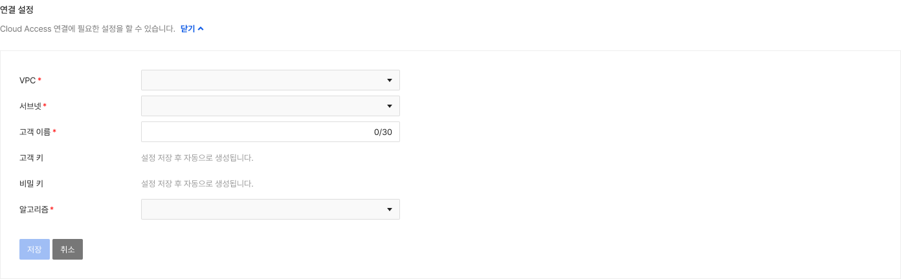
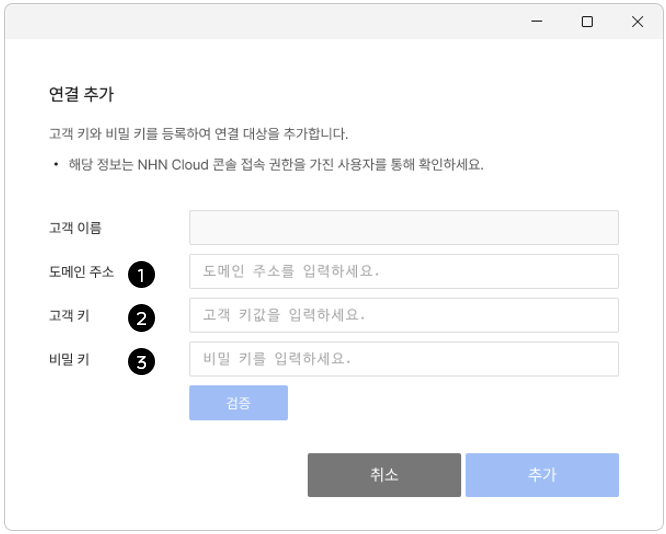
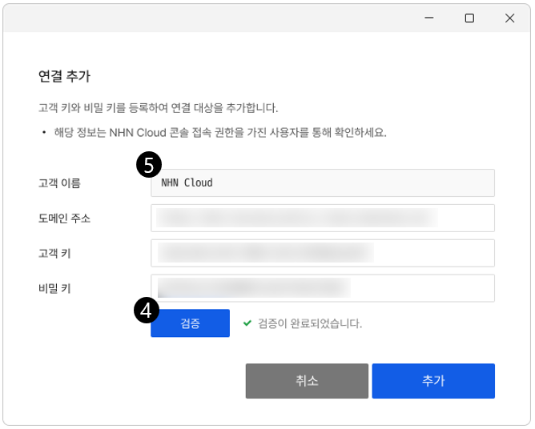
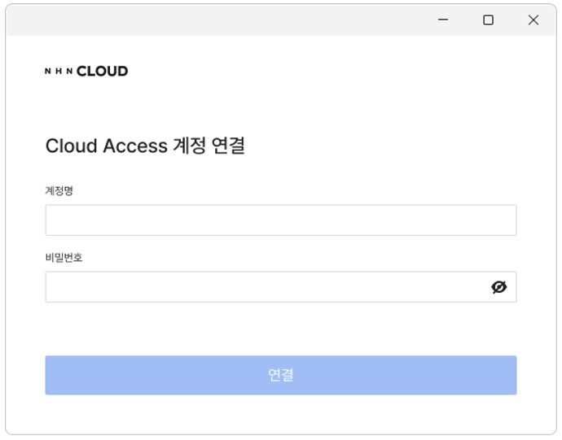

<!-- pre-align:aligned sig=7d9aee4cb102 -->

# Getting Started with Cloud Access

**Security > Cloud Access > Console User Guide > Getting Started with Cloud Access**

 

## Console Settings { #console-settings }

After preparing the agent, configure the connection and routing settings to start using the Cloud Access service.

 

### Save Configuration Information { #save-configuration-information }

Enter and save the connection settings. Once saved, Cloud Access becomes available.

* Select a VPC and subnet.
    * If you don't have a VPC or subnet, create them via the **VPC** and **Subnet** menus in the NHN Cloud console.
* Enter a customer name.
    * You can use KKorean and English letters, numbers, and some symbols (-, _, .).
* Select an encryption algorithm.
    * Supports AES-256 and ChaCha20 algorithms.

!!! danger "Caution"
    * Before saving the settings, make sure that the selected VPC has the Internet Gateway attached.
        * If the Internet Gateway is not attached, Cloud Access is unavailable.
    * When saving the configuration information, create two interfaces required for Cloud Access, one VIP for redundancy, and one Floating IP. Be cautious not to delete these resources after creation.

 

## Route Settings { #route-settings }

Configure routing so users connected via agents can access internal instances.

### One VPC { #one-vpc }

* User IP assigned band: 10.0.0.0/24
* VPC: 172.16.0.0/12
* Subnet selected when creating Cloud Access: 172.16.0.0/24
* Accessible band: 172.16.100.0/24

When set as above, select the routing table to which the instance requiring connection belongs in **Network - Routing** and add the following rules to the **Route** tab.

* Destination CIDR: 10.0.0.0/24
* Gateway: NCAccess_INF_SUB_PORT_VIP of type Virtual_IP

### Two VPCs { #two-vpcs }

* User IP assigned band: 10.0.0.0/24
* VPC1: 172.16.0.0/12
* VPC2: 192.168.0.0/16
* Subnet selected when creating Cloud Access: 172.16.0.0/24
* Accessible band: 192.168.0.0/24

When set as above, set up peering between VPC1 (local) and VPC2 (peer). Then, in **Network - Routing**, select the routing table to which the instance to connect belongs and add the following rules to the **Route** tab:

* Target CIDR: 10.0.0.0/24
* Gateway: a PEERING type network interface created between VPC1 and VPC2

Then, select the **Route** tab in **Peering Gateway - Peering** to add a local route rule.

* Destination CIDR: 10.0.0.0/24
* Gateway: NCAccess_INF_SUB_PORT_VIP of type Virtual_IP

### Other Projects { #other-projects }

* User IP assigned band: 10.0.0.0/24
* Project 1 VPC: 172.16.0.0/12
* Project 2 VPC: 192.168.0.0/16
* Subnet selected when creating Cloud Access: 172.16.0.0/24
* Accessible band: 192.168.0.0/24

When set as above, set up peering between Project 1 (local) and Project 2 (peer). Then, in **Network - Routing**, select the routing table to which the instance to be connected belongs and add the following rule to the **Route** tab.

* Target CIDR: 10.0.0.0/24
* Gateway: a PEERING type network interface created between Project 1 VPC and Project 2 VPC

Then, select the **Route** tab in **Peering Gateway - Project Peering** to add a local route rule.

* Destination CIDR: 10.0.0.0/24
* Gateway: NCAccess_INF_SUB_PORT_VIP of type Virtual_IP

!!! danger "Caution"
    * Communication is possible only when the user IP allocation range is allowed in the Security Groups applied to the instance.
    * The user IP allocation range cannot overlap with the items below:
        * The selected subnet
        * The accessible network range
    * When connecting two or more subnets to an instance, if a subnet overlaps with the user IP allocation range, communication will not function properly.

 

## Download the Agent { #download-the-agent }

Download the agent to use Cloud Access. The service supports the following OS:

* Windows 10 1903 or later (32bit/64bit)
* Windows 11 (64bit)
* macOS 13.3 or later

| OS | Version| Download | Update date |
|--------|------|------|------|
| Windows(64bit)|1.2.0|[CloudAccess_Setup_x64](https://kr1-api-object-storage.nhncloudservice.com/v1/AUTH_04c78c238ba54583bb1036b393ec6ae5/windows/installer/CloudAccess_Setup_x64.exe)|2026. 01. 13.|
| Windows(32bit)|1.2.0|[CloudAccess_Setup_x86](https://kr1-api-object-storage.nhncloudservice.com/v1/AUTH_04c78c238ba54583bb1036b393ec6ae5/windows/installer/CloudAccess_Setup_x86.exe)|2026. 01. 13.|
|macOS|1.1.1|[CloudAccess_macOS](https://kr1-api-object-storage.nhncloudservice.com/v1/AUTH_04c78c238ba54583bb1036b393ec6ae5/macos/CloudAccess%20Installer.dmg)|2026. 01. 13.|

!!! tip "Notice"
    The Cloud Access Agent is a dedicated application that enables safe remote access to internal services by establishing a secure connection between the user's device and the service.
    
 

## Add a Connection { #add-a-connection }

### Add Connection { #add-connection }

Add a connection item to access NHN Cloud resources via the agent.

Enter the ➊ Domain address, ➋ Customer key, and ➌ Secret key, provided by an administrator with NHN Cloud console permissions.

 

Click the ➍ **Validate** button. Once verified, the ➎ Customer name will be shown. Click **Add** to complete the connection.

### Delete Connection { #delete-connection }

Click a connection item to activate the **Delete Connection** button and remove the connection.

 

!!! tip "Note"
    * The required values for connection setup can be obtained from an administrator with NHN Cloud console permissions.
        * Once verification is completed, the customer name is automatically displayed as set by the administrator.
    * You can register multiple connections, but only one can be active at a time.

 

## Tunnel Connection via Authentication { #tunnel-connection-via-authentication }

Select the required connection and click **Connect** to proceed with authentication.

### Notice Settings { #notice-settings }

* Displays notices set by the administrator.  
    * Will not be shown if the option is disabled under **Settings > Notice Settings**.

### First Authentication (Account & Password) { #first-authentication-account-password }

* Account Name: Enter the account received from the administrator.
* Password: Enter the temporary password sent to your registered email.
* Save Account Name: After clicking and logging in, the account name you logged in with will be automatically entered and exposed when you log in again.

### Agree to collection and usage of personal information { #agree-to-collection-and-usage-of-personal-information }
* Personal information is collected to operate Cloud Access service.
    * Declining the agreement may restrict service use.

### Additional Authentication { #additional-authentication }

* After the first authentication is completed, additional authentication is performed according to the policy configured by the administrator.
    * Four authentication methods are supported, as shown below.
        * Email
        * Mobile phone 
        * TOTP (time-based one-time password) 
        * Biometrics (Passkey)

### Change Initial Password { #change-initial-password }

* Change the initial password.
    * Follow the password policy set by the administrator.

 

!!! tip "Note"
    * When an account is created, a temporary password and agent download link are sent to the user’s registered email.
    * The personal information agreement is displayed only at the user's first login and is considered accepted only after a successful connection. If the process is canceled, the user must agree again.
    * The following password rules always apply, regardless of the admin’s policy:
        * 6–30 characters in length
        * Cannot be the same as the user account (ID)
    * **Save Account Name** only exposes the account name that was previously logged in, and does not expose accounts that were not logged in.

 

## Agent Features { #agent-features }

Overview of the agent tray icon features.

 

### Before Connecting to Agent { #before-connecting-to-agent }
 * Open: Displays the connection screen.
 * Connect: Shows connection items.
 * Check Updates: Verifies agent version and updates if necessary.
* Version Info: Shows current version, open source licenses, and privacy policy.
 * Settings: Configure agent settings and language.
      * Cloud Environment Settings: Choose a public cloud.
      * Language Settings: Korean, English, Japanese
 * Quit: Close the agent.

### After Connecting to Agent { #after-connecting-to-agent }
Shows customer and account names.
* Open: Displays connection screen.
* Disconnect: Disconnects the agent.
* Change Password: Changes the password.
* Notice: Displays announcements (if available).
* Version Info: Shows version and legal info.
* Quit: Close the agent.

 

## Delete Agent { #delete-agent }

Users can delete the agent at any time.

* Windows: Go to Settings > Apps > Installed apps, select Cloud Access, and click Delete
* macOS: Go to Finder > Applications, then drag Cloud Access to the Trash to delete it

!!! danger "Caution"
    Deleting the agent may restrict or disable access to Cloud Access services.